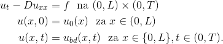
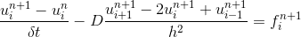
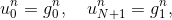
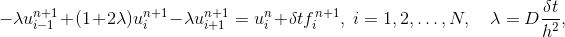
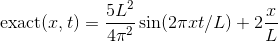
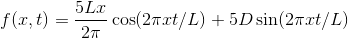

# Konačne diferencije za paraboličku zadaću u 1D

Treba riješiti rubnu zadaću:



metodom konačnih diferencija s uniformnim prostornim korakom h i vremenskim korakom dt.
Uzimamo da je koeficijen difuzije D strogo pozitivan tako da je zadaća paraboličkog tipa. 

Na zadaće paraboličkog tipa redovito primijenjujemo implicitnu vremensku diskretizaciju, budući
da eksplicitna diskretizacija vodi na suviše mali vremenski korak dt.  Diferencijska jednadžba stoga glasi:



 na mreži <a href="https://www.codecogs.com/eqnedit.php?latex=x_i&space;=&space;i&space;h,&space;h=L/(n&plus;1)" target="_blank"></a>. Jednadžbu diskretiziramo samo u unutarnjim točkama domene (i=1,...,N) dok u rubnim točkama 
uvažavamo Dirichletove rubne uvjete. Radi jednostavnosti apisat ćemo te uvjete u obliku:



za sve vremenske trenutke n. 

U svakom vremenskom trenutku treba riješiti linearni sustav sa tridijagonalnom matricom:




Diferencijske jednadžbe uzimamo samo u unutarnjim točkama mreže ili drugim riječima, diferencijalnu jednadžbu 
aproksimiramo samo u unutarnjim točkama mreže. U krajnjim točkama, i=0, i=N+1, umjesto diferencijskih 
jednadžbi koristimo rubni uvjet.

*Napomene:* 

1. Ovakav tretman rubnog uvjeta narušava simetriju matrice sustava.

1. Koristiti mrežu `Dune::OneDGrid` iz modula **dune-grid** (pogledajte dokumentaciju). Ova mreža daje
   standardnu ekvidistantnu 1D mrežu koju možemo koristiti kao i *ručno pisanu* ekvidistantnu mrežu.
   To znači da ne moramo koristiti `Dune::IndexSet` i možemo iterirati kroz vrhove mreže u običnoj for-petlji.

1. Rješenje testiramo na *fabriciranom rješenju*. Takvo rješenje se dobiva tako da se uzme 
   jedna funkcija kao egzaktno rješenje i njenim uvrštavanjem u diferencijalnu jednadžbu dobiva se
   desna strana jednadžbe. Inicijalni i rubni uvjeti dobivaju se direktno iz odabranog egzaktnog rješenja. 
   Jedan primjer je sljedeći:
   .
   Pripadna desna strana je  
   .

1. Simulacija se vrši u **vremenskoj petlji** u kojoj pamtimo rješenje na trenutnom (`xnew`) i prethodnom 
   vremenskom sloju (`xold`). Petlja ima sljedeću formu:
   ```c++
   double t = 0.0;
   while (t < T) {
       t = t+dt;
       xold = xnew;
       // ....
   }
   ```
   Prije ulaza u petlju treba `xnew` inicijalizirati  početnim podatkom.

1. Kada ispisujemo  niz rješenja u različitim vremenskim trenucima koristimo klasu 
   `Dune::VTKSequenceWriter<GridView>` (modul **dune-grid**). Prije ulaska u vremensku petlju objektu ove klase 
   dodajemo sva polja koja želimo ispisivati. Na primjer,
   ```c++
   Dune::VTKSequenceWriter<GridView> writer(gv, "solution", ".", ".");
   writer.addVertexData(xnew, "numeric");
   writer.addVertexData(exact, "exact");
   ```
   gdje je `exact` vektor koji sadrži egzaktno rješenje u danom vremenskom trenutku. 
   Unutar vremenske petlje, na njenom kraju, dodjemo naredbu 
   ```c++
   writer.write(t);
   ```
   kojom ispisujemo sva dodana polja u trenutku `t`. Klasa `Dune::VTKSequenceWriter<GridView>`
   kreira za svaki vremenski trenutak jednu VTK datoteku te kreira jednu **.pvd** datoteku 
   (u ovom slučaju *solution.pvd*) koja povezuje vremenski trenutak s odgovarajućom VTK datotekom.
   U Paraview programu se otvara `.pvd` datoteka. 
